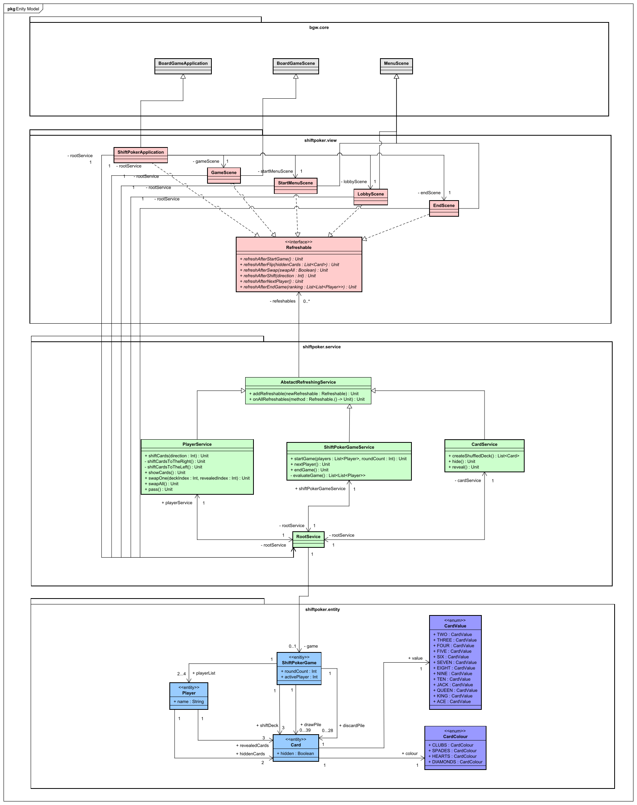
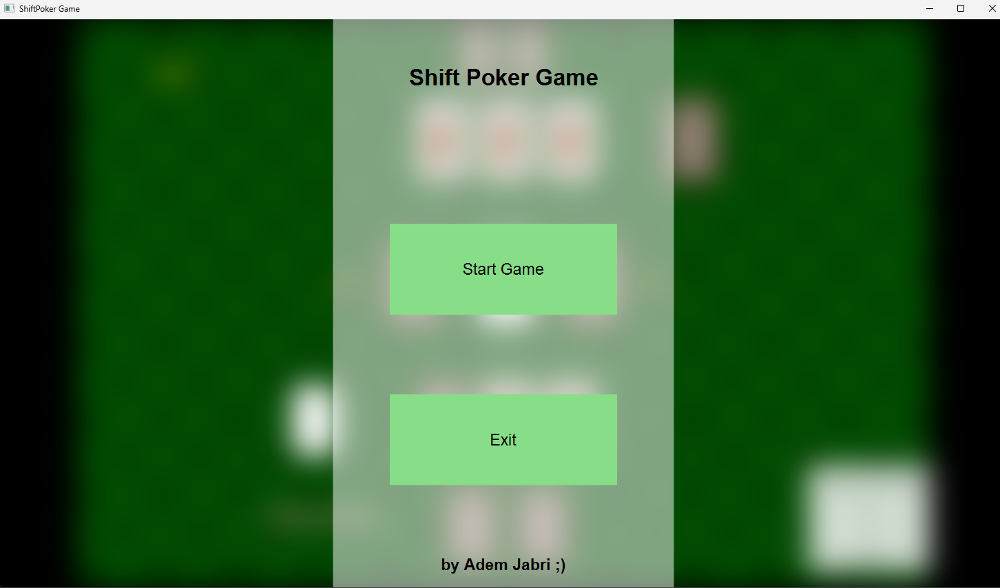
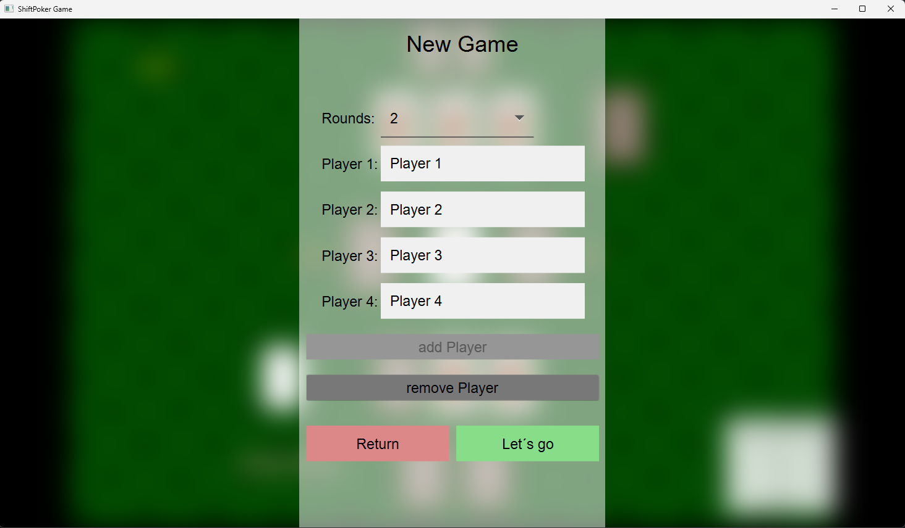
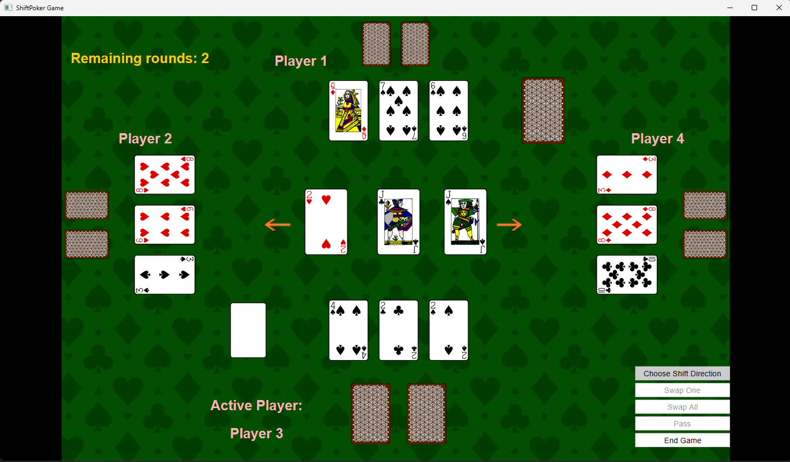
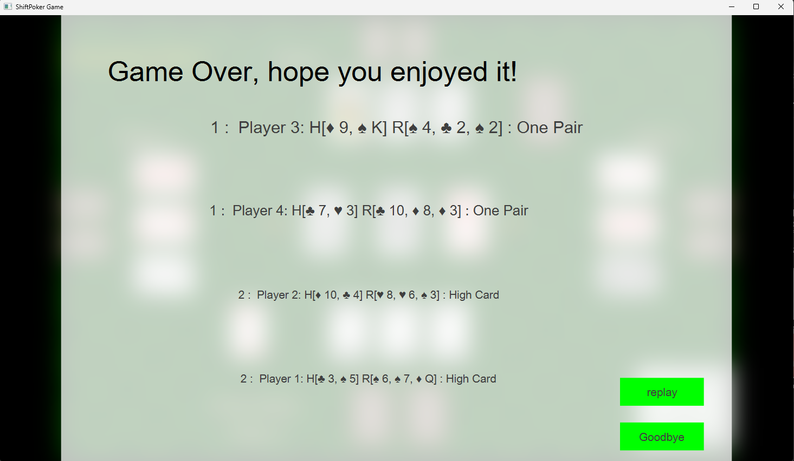

# Shift Poker

## Material and Setup

Shift Poker is a card game for 2-4 players, played with a standard deck of 52 cards:
- Suits: Clubs, Spades, Hearts, Diamonds
- Ranks: 2, 3, 4, 5, 6, 7, 8, 9, 10, Jack, Queen, King, Ace

At the beginning of the game, each player receives two hidden cards and three open cards. The open cards are placed in the middle. The remaining cards form a draw pile. Additionally, there is a discard pile, which is empty at the start of the game.

Players agree on a number of rounds to play, between two and seven.

## Game Play

Starting with a random player, players take turns in sequence. Each turn, a player must perform two actions:

### Action 1 - Shift

- The player selects a card to be shifted left or right.
- When shifting left, the leftmost card in the middle is placed on the discard pile, and the remaining cards move one position to the left. The rightmost position is filled with a card from the draw pile (see image for before and after states).
- Shifting right is analogous.

### Action 2 - Swap

The player either:
- Swaps one of their open cards with one from the middle,
- Swaps all three of their open cards with the three cards in the middle, 
- Or decides not to swap.

## Evaluation

The evaluation of hands follows traditional poker rules, but if two players have the same combination (e.g., One Pair), it is considered a tie without considering the rank of the cards in hand.

### Poker Hand Rankings and Probabilities

| Name             | Description                  | Example           | Decision Criterion                          | Probability (Five Cards) | Probability (Seven Cards) |
|------------------|------------------------------|-------------------|---------------------------------------------|--------------------------|---------------------------|
| High Card        | No combination               | A♠                | Highest individual card                     | 50.12%                   | 17.41%                    |
| One Pair         | Two cards of the same rank   | 10♠ 10♥           | Highest pair and kickers                    | 42.26%                   | 43.83%                    |
| Two Pair         | Two pairs                    | J♠ J♦ 8♣ 8♠       | Highest pairs and kicker                    | 4.75%                    | 23.50%                    |
| Three of a Kind  | Three cards of the same rank | Q♠ Q♥ Q♦          | Highest three of a kind and kickers         | 2.11%                    | 4.83%                     |
| Straight         | Five cards in sequence       | 7♥ 8♠ 9♦ 10♥ J♠   | Highest card in the sequence                | 0.39%                    | 4.62%                     |
| Flush            | Five cards of the same suit  | 3♠ 5♠ 8♠ 9♠ K♠    | Highest card in the flush                   | 0.20%                    | 3.03%                     |
| Full House       | Three of a kind and a pair   | K♥ K♦ K♠ 9♠ 9♣    | Highest three of a kind and highest pair    | 0.14%                    | 2.60%                     |
| Four of a Kind   | Four cards of the same rank  | A♠ A♦ A♥ A♣       | Highest four of a kind and kicker           | 0.02%                    | 0.17%                     |
| Straight Flush   | Straight of the same suit    | 8♣ 9♣ 10♣ J♣ Q♣   | Highest card in the straight flush          | 0.0014%                  | 0.028%                    |
| Royal Flush      | Straight flush with Ace high | 10♥ J♥ Q♥ K♥ A♥   | Split Pot                                   | 0.000154%                | 0.0032%                   |

*Table source: [Wikipedia](https://de.wikipedia.org/wiki/Poker)*

## Domain Model

## Start Menu Scene

## Lobby Scene

## Game Scene

## End Scene

## Enjoy the Game

If you want to enjoy the game, feel free to contact me at my email address: [adem.jabri@tu-dortmund.de](adem.jabri@tu-dortmund.de).
